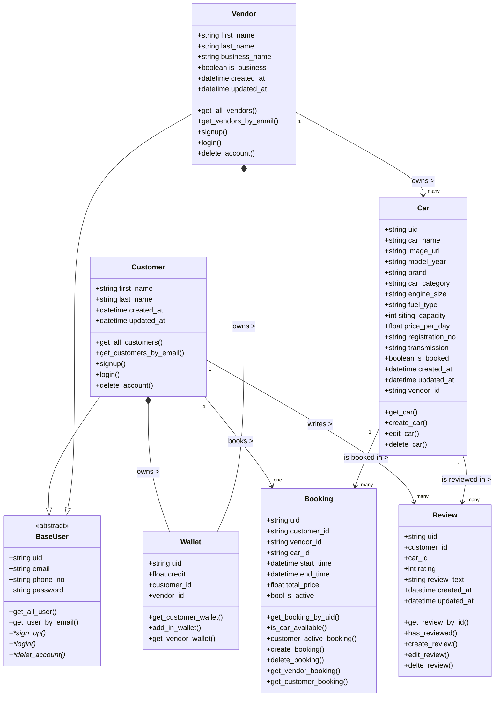

# Carento

**Carento** is a Python-based project designed to facilitate ***car rental*** services.
This repository reflects a modular and scalable architecture, prepared for local 
development and cloud deployment.

---
## Features

- 🔐 User authentication and role separation (customer/vendor)
- 🚗 Car management module for vendors
- 📅 Booking management
- 💼 Wallet for payments
- ⭐ Review system for feedback
- 🔧 Modular folder structure for easy scaling

---
## 📁 Project Structure
```
├── src/
│   ├── auth/
│   │   ├── __init__.py
|   |   ├── Dependencies.py
|   |   ├── oauth2.py
│   │   └── schemas.py
│   ├── booking_table/
│   │   ├── __init__.py
│   │   ├── routes.py
|   |   ├── schemas.py
│   │   └── service.py
│   ├── review/
│   │   ├── __init__.py
│   │   ├── routes.py
|   |   ├── schemas.py
│   │   └── service.py
│   ├── users/
│   │   ├── __init__.py
│   │   ├── routes.py
|   |   ├── schemas.py
│   │   └── service.py
│   ├── vehicles/
│   │   ├── __init__.py
│   │   ├── routes.py
|   |   ├── schemas.py
│   │   └── service.py
│   └── wallet/
│   │   ├── __init__.py
│   │   ├── routes.py
|   |   ├── schemas.py
│   │   └── service.py
│   ├── __init__.py
│   ├── config.py
|   ├── README.md
│   └── utils.py
├── .env
├── Procfile
└── requirements.txt
└── README.md


```

---


## 🛠️ Tech Stack

- FASTAPI 🟢
- PostgreSQL
- JWT for authentication 🔑

---


---

## Installation

1. **Clone the repository:**

```bash
git clone https://github.com/cyxabima/Carento-Server-API.git
cd Carento-Server-API
```

2. **Create a virtual environment:**
```bash
python -m venv venv
```
3. **Activate virtual environment:**
```bash
### On macOS/Linux:
source venv/bin/activate
### On Windows:
venv\Scripts\activate
```

4. **Install dependencies:**
```bash
pip install -r requirements.txt
```
5. **Run the Server:**
``` bash 
    fast-api dev src
```
---
## Class Diagrams

